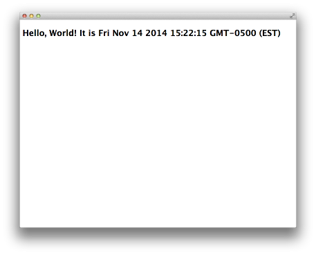

## workshop-cca-eh

Eh is a real-world messaging application, built with [Chrome Apps for Mobile](https://developer.chrome.com/apps/chrome_apps_on_mobile), that brings out the inner Canadian in all of us.

This workshop will walk you through building your very own Eh app, eh.  It mostly focuses on a few powerful APIs (google cloud messaging, rich notifications, identity), but it incorporates a bit of [Polymer](https://www.polymer-project.org/) and some [Material Design](https://www.google.com/design/spec) elements as well.

### Background

[Chrome Apps](https://developer.chrome.com/apps/about_apps) are packaged, installable apps that run on desktop and are written using web technologies.  They run in a hightened security sandbox, and so have access to powerful [supplementary APIs](https://developer.chrome.com/apps/api_index), which are not available to traditional websites.

[Chrome Apps for Mobile](https://github.com/MobileChromeApps/mobile-chrome-apps) is a toolkit for porting Chrome Apps to run on mobile devices, using [Apache Cordova](http://cordova.apache.org).  Read [more info](https://github.com/MobileChromeApps/mobile-chrome-apps/blob/master/README.md) and [caveats](https://github.com/MobileChromeApps/mobile-chrome-apps/blob/master/docs/CordovaConsiderations.md).

### Prerequisites

Let's configure your development environment and run a sample app to make sure you can get started building the Eh app.

* First, clone this repository.

        git clone https://github.com/MobileChromeApps/workshop-cca-eh.git

* Next, install the [`cca`](https://www.npmjs.org/package/cca) command line tool by following this [installation guide](https://github.com/MobileChromeApps/mobile-chrome-apps/blob/master/docs/Installation.md).

* Connect your Android device to the desktop via USB.
  * **Note:** Make sure you have [*Developer Options* and *USB Debugging* enabled](http://developer.android.com/tools/device.html#developer-device-options).

    > To access these settings, open the Developer options in the system Settings. On Android 4.2 and higher, the Developer options screen is hidden by default. To make it visible, go to **Settings > About phone** and tap **Build number** seven times. Return to the previous screen to find Developer options at the bottom.

* Optionally, install the `Chrome App Developer Tool` (CADT) *on your Android device* using this [Download Link](https://drive.google.com/uc?export=download&confirm=fjug&id=0B0UdPHoQPXheQjAwdmZfOENrQjQ).
  * If you are unsure, skip this step for now.
  * Simplest way is to visit this guide from your Android device and click the above link.  Or just email the url to yourself :)
  * **Note:** This CADT is custom-built for this workshop.  It contains special configuration for Google Cloud Messaging.
  * For the future, official releases of CADT can be found [here](https://github.com/MobileChromeApps/chrome-app-developer-tool/releases), but those won't work with this workshop.

#### Workflow

* Create a new project, importing the `app/` folder from this repo.

        cca create EhApp --copy-from ../PATH_TO/workshop-cca-eh/app/
        cd EhApp
        cca build android

* Now, lets run the app.  You have a few options:
  1. Compile and run the app on android: `cca run android --device`.
  2. Push to the pre-built CADT you downloaded earlier: `cca push --watch`.  (Don't forget to start CADT first!).
  3. From Mac OSX only, preview your app locally if you have [Chrome Canary](https://www.google.com/intl/en/chrome/browser/canary.html) installed: `cca run chrome`.

### Lets Get Started, Eh!

Now that you have your development environment set up, you can start building the Eh app on desktop or mobile.  This workshop will walk through each step to build it from scratch.

_**Continue to [Step 1: Getting Started &raquo;](https://github.com/MobileChromeApps/workshop-cca-eh/blob/master/docs/step1.md)**_
